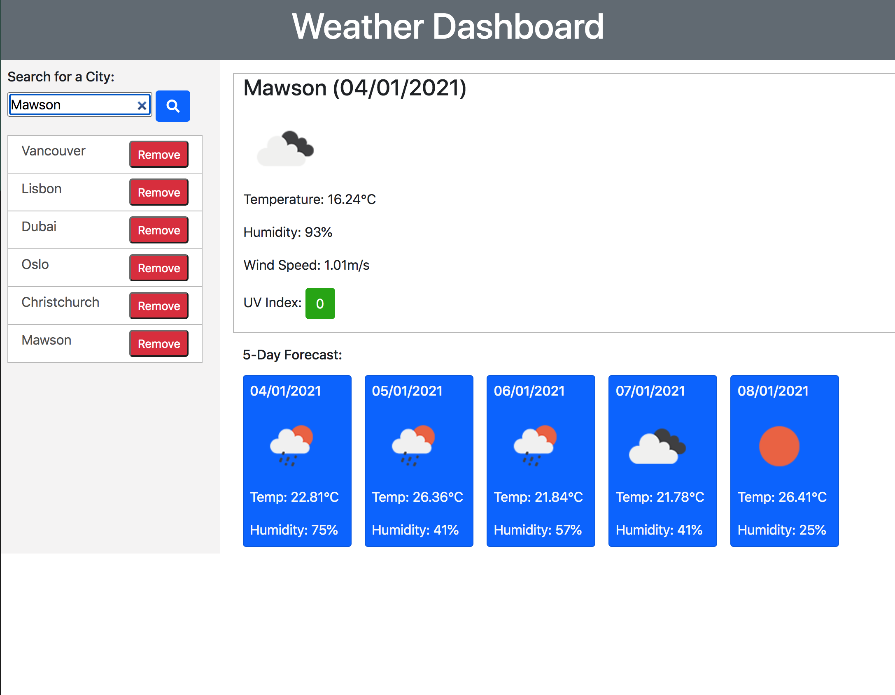

# Weather Dashboard

## Aim:

To create a simple weather dashboard application that enables the user to find out the current weather and 5-day forecast for a given city. Every cty search is saved so the user can build their own personal list of cities for which they would like weather details.

## Goals:

* Current and future weather conditions are given when user chooses or searches for a city. 

* Every city entered in the search box is added to the search history. 

* Search history is recalled when page is reloaded. 

* Search history can be controlled with the option to remove a city from the list. 

* Current weather for a city includes: city name, the date, an icon representation of weather conditions, the temperature, the humidity, the wind speed, and the UV index.

* UV index includes a color based on data from the WHO indicating whether conditions are favoarble. moderate or severe.

* 5-day forecast displays the date, an icon representation of weather conditions, the temperature, and the humidity.

* Clicking on a city name in the search history will retrieve the current and future weather condiions for that city.

Screenshot of the implemented Weather Dashboard:

Link to deployed application:

https://blakestickland.github.io/weather-dashboard/

## To be implemented in the future:

* When a new search for a city is submitted, check the stored array of cities for that city and return a message indicating the city is the previous search list.

* Responsive buttons and images (the weather icons in this case) to shrink with the screen size.

## Compromises:

* Attempted to make both the buttons and the images responsive but have had no luck in getting them to shrink in proportion to the screen size. 

* Found white text difficult to read on the (possible) yellow background of the UV index so change the text-color to black in that scenario. 

